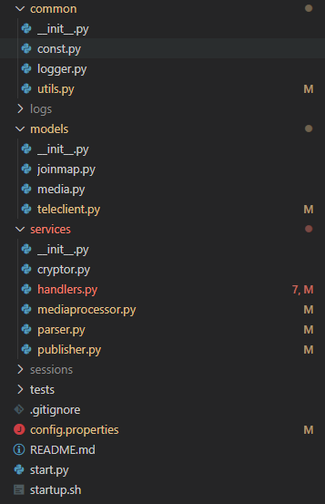

# Telegram文档

## 开发

- **开发环境**
    - python >= 3.6.5
    - [telethon == 1.10.3](https://docs.telethon.dev/en/latest/)
    - [tornado == 6.0.3](https://www.tornadoweb.org/en/stable/)
    - pycryptodome
    - pycurl
    - aiormq
    - pysocks
    - mmh3 (`conda install -c keiserlab mmh3`)

    > **Tips:** *建议使用 `Miniconda` 进行环境管理*

- **项目结构**

    

    - common：
        - const.py: 解析配置文件，记录公共常量
        - logger.py: 日志
        - utils.py: 工具类
    - model:
        - joinmap.py: 这是一个`Sqlite`包装类，主要用于记录订阅了哪些群，订阅的群信息是通过事件实时返回的
        - media.py: 媒体对象，包装Telegram消息中的图片、视频、文件等，用于获取其详细信息
        - teleclient.py: 对Telethon库的TelegramClient对象进行的包装，里面是整个采集的核心接口
    - service:
        - cryptor.py: AES加密解密器
        - handler.py: HTTP服务处理器，用于处理HTTP请求
        - mediaprocessor.py: 媒体文件处理器，用于下载并上传媒体对象
        - parser.py: Telegram原始数据解析器，数据解析在这里进行
        - publisher.py: Telegram订阅消息发布器，用于和RabbitMQ连接
    - sessions: 登录会话文件（sqlite文件），采集账户的登录信息存储在这里，不用重复登录
    - tests: 单元测试
    - start.py: 程序入口
    - config.properties：配置文件
    - startup.sh: 启动脚本，直接运行此脚本到服务器即可后台运行

- **主要类说明**
    - model/teleclient.py#TeleClient

        此类是 `telethon` 库的包装类，重新包装了登录及内容获取等接口。</br>

        `telethon` 的 `Entity` 对象（主要指 `User`, `Channel`）分为两类：
        `InputEntity（比如：InputChannel, InputPeerChannel）`类和`Entity（比如：Channel）`类。这两种内置对象都可以作为`telethon`库接口的入参，来获取数据。

        需要注意，Telegram获取数据的接口是通过`(entity_id, client_entity_hash)`二元组来进行确认的。想要获取任何`Entity`的基本信息及内容信息，都需要这个二元组。因此无法只通过`entity_id`进行内容获取。这个二元组的值的获取方法是通过`@username`调用Telegram的`UsernameResovleRequest`接口。但是这个接口有访问频率限制，过快访问会被限制使用。所以Telegram会要求客户端把访问过的`Entity`的这个二元组信息存入本地`session`记录，因此，`session`中是有每个客户端和每个群的这个二元组信息的。`telethon` 也提供了对应的方法来查询，所以这要求我们在使用的时候，一定要尽可能的优先使用 `entity_id` 查找 `InputEntity`对象作为接口的入参，如果查不到，再使用`@username` 进行向Telegram服务器请求`Entity`对象。</br>

        此类已经实现了优先使用`entity_id`获取`InputEntity`对象。

    - model/teleclient.py#TeleClients

        此类是资源池对象，采集账号资源都会委托给此类管理，账号调度方案是轮询。</br>

        > **Tips:** *如果要改进轮询方案，可以采用加权轮询（存储方式改为堆/优先队列），统计账号的下载任务数作为权，如果下载任务数多，应该减少这个账号的使用。因为Telegram的下载任务是和账号绑定的，要避免一个账号堆积过多的下载任务而造成下载受限*

    - services/mediaprocessor.py#MediaProcessor

        此类主要作用是异步处理下载任务。因为Telegram的媒体对象不提供连接，只提供二进制数据流，所以需要将媒体对象下载到本地进行存储。Telegram媒体对象内置了一个hash值，这个hash值和获取这条消息的`TelegramClient`对象有关，因此下载任务是和账号绑定的。</br>

        此类主要使用了`AsyncGenerator`技术。`tornado`提供的`Queue`对象是一个异步队列，可以像多线程的`BlockingQueue`那样进行并发存取任务。`tornado`的`gen.multi`支持将一个协程列表中的任务并发运行。（相当于对 `loop.create_task(coroutine)`的包装。）

    - start.py#Server

        服务器包装类，用于初始化重要参数，启动HTTP服务器</br>

        > **Tips:** *服务器没有实现关闭监听，可以使用另一个线程监听某个端口，然后使用shell脚本发送关闭消息进行服务器关闭。目前由于没有关闭监听，关闭服务器需要直接杀死对应的python进程，比较麻烦，而且无法实现关闭服务器时的状态保存与开启服务器时的状态恢复。*

- **技术介绍**

    - Python异步IO库 —— [asyncio](https://www.liaoxuefeng.com/wiki/1016959663602400/1017970488768640)
        - 异步IO基本原理

            异步IO是使用操作系统底层的事件通知机制，在IO阶段不对线程进行阻塞，来实现单线程并发的效果。</br>

            比如，阻塞IO服务器在接受TCP连接时，过程为：`监听连接 -> TCP握手 -> 连接建立 -> 数据读写`。在这整个过程中，线程处于阻塞状态，因此常见的服务器如 `Tomcat` 会准备一个线程池，每次收到客户端连接的时候，从线程池中取一个线程进行处理，来达到并发。这种线程模型的服务器缺点就很明显，线程数的上限决定了服务器的并发能力，并且需要处理并发冲突。</br>

            异步IO的过程为：`启动事件循环 -> 监听连接（不阻塞，没有连接请求时直接返回，进入下一次事件循环）-> TCP握手(不阻塞，如果TCP连接没有建立完成，直接返回并进入下一次循环) -> 连接建立(TCP连接可用，本次循环就会进入这个函数的下一步操作)`。异步IO通过单线程事件循环（死循环）监听IO的可读/可写状态，不让IO操作阻塞整个线程，而是通过让步让CPU处于一直运行状态，提高CPU利用率，实现并发。其优点非常明显：没有多线程的资源消耗；不需要考虑并发冲突。但是它要求每次CPU操作要快速，因为是单线程，一个任务一直占用CPU会导致其他任务无法执行。

        - Python中的异步IO

            Python通过 `async` 关键字来声明一个协程，协程可以理解为Python异步IO中的一个任务，通过 `await` 关键字来等待协程的结果。一个典型的例子：

            ```python {.line-numbers}
            import asyncio  # 引入异步库

            # 创建协程 task_a, 该任务通过网络（用睡眠来模拟创建连接需要2s时间）获取一些数据
            async def task_a():
                # 这里不能用 time.sleep(2)，time.sleep()是阻塞函数，会直接阻塞主线程，不具有异步IO的效果
                await asyncio.sleep(2)
                return [1,2,3,4,5]  # 获得的数据

            # 创建协程 task_b, 该任务处理数据，如果处理完，则向task_a请求新的数据
            async def task_b():
                # data初始值代表上一次任务未处理完的数
                data = [1,2,3]

                while True:
                    # 处理方式是打印所有数据
                    for d in data:
                        print(d)

                    # 处理完成后，获取下一次要处理的数据
                    data = await task_a()

            async def task_c():
                asyncio.sleep(1)
                print("这是并发任务C")

            if __name__ == "__main__":
                # 因为task_a再task_b中被调用了，所以只需要将task_b加入事件循环即可
                asyncio.create_task(task_b())
                # 把并发任务task_c也放入事件循环
                asyncio.create_task(task_c())
                # 让事件循环一直运行，运行效果是先打印出1,2,3; 以后每隔2s打印1，2，3，4，5; 同时每隔一秒会并发执行 task_c
                asyncio.run_forever()
            ```

- **工作流程**

    1. 客户端发起请求
    2. 根据 `start.py#Server` 中的路由映射到对应的 `services/handlers.py#XXXXHandler`
    3. 解析请求数据，调用相关方法获取原始数据
    4. 使用 `services/parser.py` 解析原始数据，将文字内容作为 `dict` 对象返回，将媒体对象包装成 `model/media.py#Media` 对象，放入 `services/mediaprocessor.py#MediaProcessor` 的下载任务队列中
    5. 对上步返回的数据进行加密包装，写入网络流
    6. 与5并发执行。下载协程从 `services/mediaprocessor.py#MediaProcessor` 下载队列中取出 `model/media.py#Media` 对象，并调用 `model/media.py#Media.download()` 方法进行异步下载（不会阻塞线程），下载完成后，将 `model/media.py#Media` 对象放入上传队列中
    7. 与6并发执行，上传协程取出上传队列中的任务，上传到存储服务器

## 部署

将项目源码上传到服务器，调整配置文件为正式环境，运行 `startup.sh` 脚本即可。
